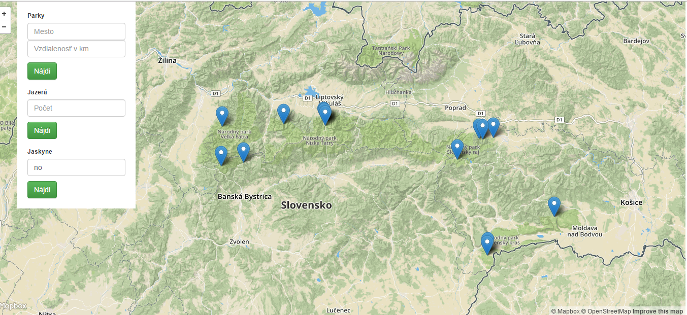

# Overview

This application shows some natural areas in Slovakia. Three scenarios are:
- displaying parks in cities
- displaying water bodies 
- displaying cave entrances

Example of functionality(Cave entrances scenario):

The application has 2 separate parts, the client which is a [frontend web application](#frontend) using mapbox API and mapbox.js and the [backend application](#backend) written in [Java EE](https://eclipse.org/), backed by PostGIS. The frontend application communicates with backend using a [REST API](#api).

# Frontend

The frontend application is a static HTML page (`index.html`), which shows a mapbox.js widget. It displays parks, water bodies or cave entrances, depending on chosen scenario. Scenarios are chosen by sidebar menu, where inputs are located.

All relevant frontend code is in `application.js` which is referenced from `index.html`. The frontend code is very simple, its only responsibilities are:
- displaying the sidebar panel with scerario inputs, driving the user interaction and calling the appropriate backend APIs
- displaying geo features by overlaying the map with a geojson layer, the geojson is provided directly by backend APIs

# Backend

The backend application is written in Java EE and is responsible for querying geo data, formatting the geojson and data for the sidebar panel.

## Data

Map data is coming directly from Open Street Maps. I downloaded an extent covering whole Slovakia (around 1.2GB) and imported it using the `osm2pgsql`tool into the standard OSM schema. GeoJSON is generated by using a standard `st_asgeojson` function.

